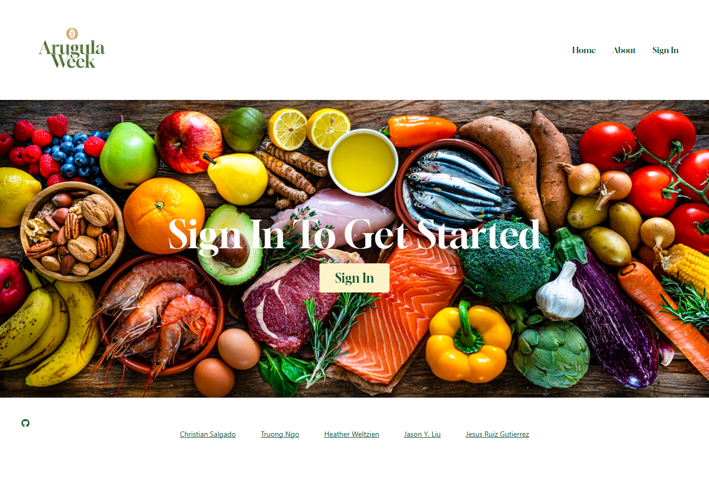
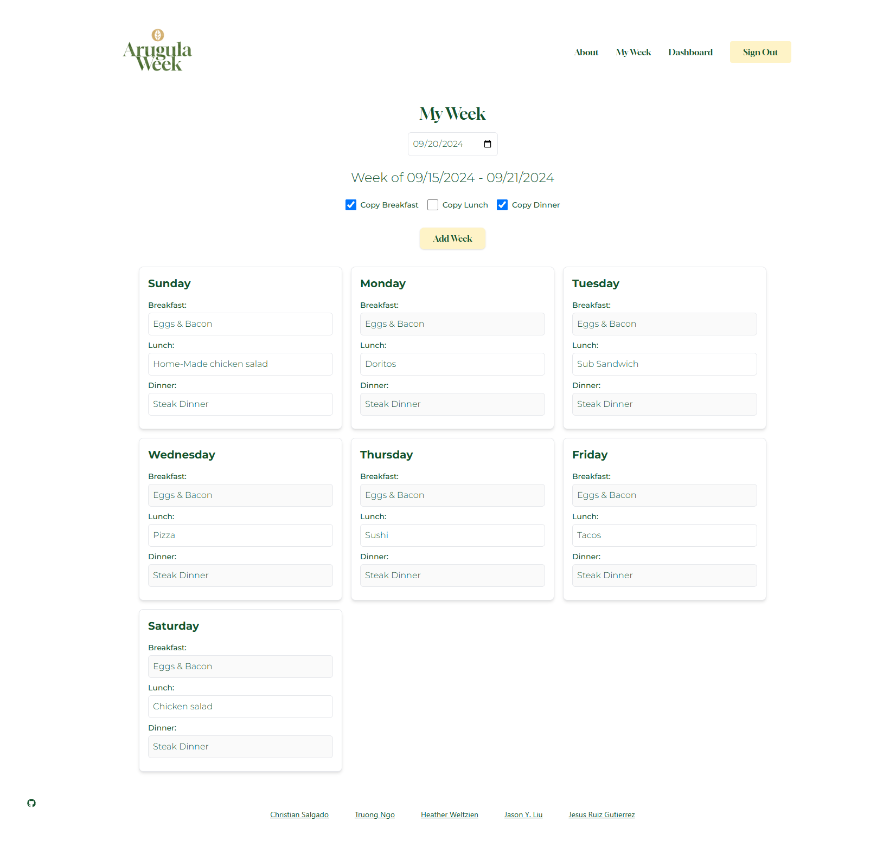

# Arugula-Week

## Table of Contents

- [Project Description](#project-description)
- [Features](#features)
- [Technologies Used](#technologies-used)
- [API Endpoints](#api-endpoints)
- [Screenshots](#screenshots)
- [License](#license)
- [Contributors](#contributors)

## Project Description

**Arugula-Week** is a full-stack web application that helps users plan and manage their meals efficiently. Users can create, update, and delete meal plans, and track the ingredients and meals they need for the week. The app is built with the MERN stack (MongoDB, Express, React, Node.js) and leverages GraphQL for efficient data querying and mutations.

# Launched Site: https://arugula-week.onrender.com/




### User Stories
- **As a user**, I want to create an account and securely log in to manage my meal plans.
- **As a user**, I want to create meal plans with specific names and descriptions.
- **As a user**, I want to add meals to my meal plans and track ingredients.
- **As a user**, I want to edit or delete my meal plans as my weekly meals change.

## Features

- User authentication with **JWT** (JSON Web Token).
- **CRUD** operations for meal plans (Create, Read, Update, Delete).
- Responsive and polished UI using **Material-UI**/**Bootstrap**/**Tailwind CSS**.
- **GraphQL API** for efficient data management.
- Deployed on **Render**.

## Technologies Used

- **Frontend**: React, Apollo Client, Tailwind CSS
- **Backend**: Node.js, Express, GraphQL, MongoDB, Mongoose
- **Database**: MongoDB (using MongoDB Atlas)
- **Authentication**: JWT for user authentication
- **Deployment**: Render for backend, Netlify for frontend
- **Version Control**: Git and GitHub

### Backend Setup

1. Clone the repository:
   ```bash
   git clone https://github.com/CrisSal2/Arugula-Week.git
   cd Arugula-Week/server
   ```

2. Install the necessary dependencies:
   ```bash
   npm install
   ```

3. Create a `.env` file and add the following environment variables:
   ```
   MONGODB_URI=<your-mongodb-atlas-connection-string>
   JWT_SECRET=<your-secret-key>
   ```

### Frontend Setup

1. Navigate to the frontend directory:
   ```bash
   cd ../client
   ```

2. Install the necessary dependencies:
   ```bash
   npm install
   ```

### Frontend and Backend Start

1. Navigate to the Arugula-Week root directory:
   ```bash
   npm run develop
   ```

### Running Locally

- After completing the installation steps, navigate to `http://localhost:3000` to view the frontend, and the backend will run on `http://localhost:4000/graphql`.
- You can register, log in, and start managing your meal plans.
  
### Deployed Version

- **Frontend**: [Netlify URL](#)
- **Backend**: [Render URL](#)

## API Endpoints

The app uses GraphQL for data fetching and manipulation. Below are some of the key queries and mutations:

### Queries

- **Get All Meal Plans**
  ```graphql
  query GetMealPlans {
    getMealPlans {
      _id
      name
      description
      meals
    }
  }
  ```

- **Get Meal Plan by ID**
  ```graphql
  query GetMealPlanById($id: ID!) {
    getMealPlanById(id: $id) {
      _id
      name
      description
      meals
    }
  }
  ```

### Mutations

- **Sign Up**
  ```graphql
  mutation SignupUser($username: String!, $email: String!, $password: String!) {
    signup(username: $username, email: $email, password: $password) {
      token
    }
  }
  ```

- **Add Meal Plan**
  ```graphql
  mutation AddMealPlan($name: String!, $description: String!, $meals: [String]!) {
    addMealPlan(name: $name, description: $description, meals: $meals) {
      _id
      name
      description
    }
  }
  ```

- **Delete Meal Plan**
  ```graphql
  mutation DeleteMealPlan($id: ID!) {
    deleteMealPlan(id: $id)
  }
  ```

## Screenshots

# Fill out your Week!


# View your weeks!
.png)

# License
  

## Contributors

- [Christian Salgado](https://github.com/CrisSal2)
- [Truong Ngo](https://github.com/ngojohn2002)
- [Heather Weltzien](https://github.com/hweltzien)
- [Jason Y. Liu](https://github.com/jy8liu)
- [Jesus Ruiz Gutierrez](https://github.com/jesse437)

